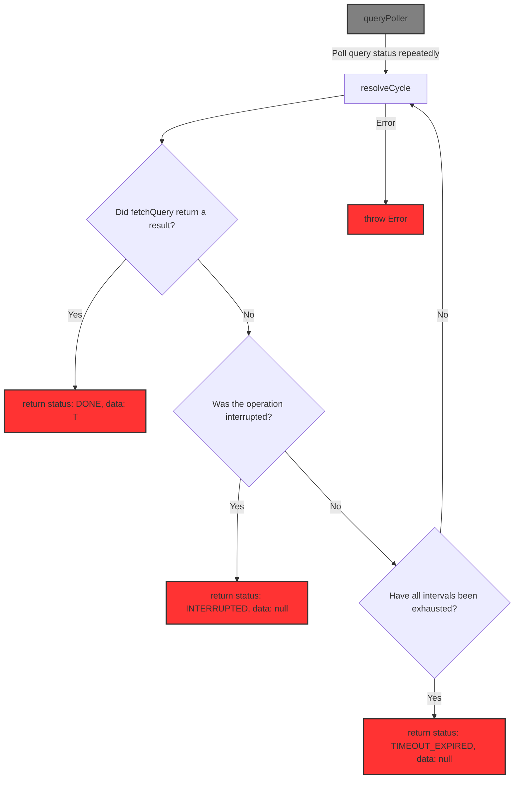

# taktwerk-poller

[](https://www.npmjs.com/package/taktwerk-poller)


A lightweight and deterministic asynchronous polling module that supports multi-stage polling with different intervals and durations, optional interruption, and predictable typed result statuses.

## Key Advantages

- Multi-stage polling with independent intervals and durations
- Deterministic outcomes (`DONE`, `TIMEOUT_EXPIRED`, `INTERRUPTED`)
- Optional interruption via promise or `AbortController`
- Fully typed result states for safe handling
- Lightweight and dependency-free

## Motivation

The goal of this module is to provide a polling mechanism that is:

- easy to test
- simple to reason about
- free from hidden side effects or implicit state
- predictable in all exit conditions

Most polling implementations suffer from tangled control flow, implicit retries, unclear interruption logic, or non-deterministic exit paths.
This leads to code that is hard to debug, hard to test, and even harder to trust.

To avoid this, taktwerk-poller is built around:

- **functional programming principles**
- **contract-based design** (explicit preconditions, postconditions, invariants)
- **pure, composable primitives** (resolveCycle)
- **clear and deterministic async control flow**

The result is a minimal, auditable polling module that behaves exactly as it declares — nothing hidden, nothing surprising.

## 📦 Installation

```bash
npm install taktwerk-poller
```

or using yarn:

```
yarn add taktwerk-poller
```

## Quick Example

```typescript

import { queryPoller } from 'taktwerk-poller'

async function fetchQuery() {
  // Simulate an async operation
  return Math.random() > 0.8 ? 'OK' : undefined
}

const interrupt = Promise.withResolvers<void>()

const result = await queryPoller(fetchQuery, [
    { durationMs: 2000, intervalMs: 250 },
    { durationMs: 5000, intervalMs: 1000 },
], interrupt.promise)

const stop = () => {
    interrupt.resolve()
}
```


## How it works

Polling stops as soon as one of the conditions is met:

- fetchQuery returns a non-undefined result
- the operation is interrupted
- all configured intervals are exhausted

Interruption can be implemented either via an external promise (as in the example above),
or internally using AbortController inside fetchQuery.

Each interval stage defines:

- how often the query is retried (intervalMs)
- how long that stage may run (durationMs)


