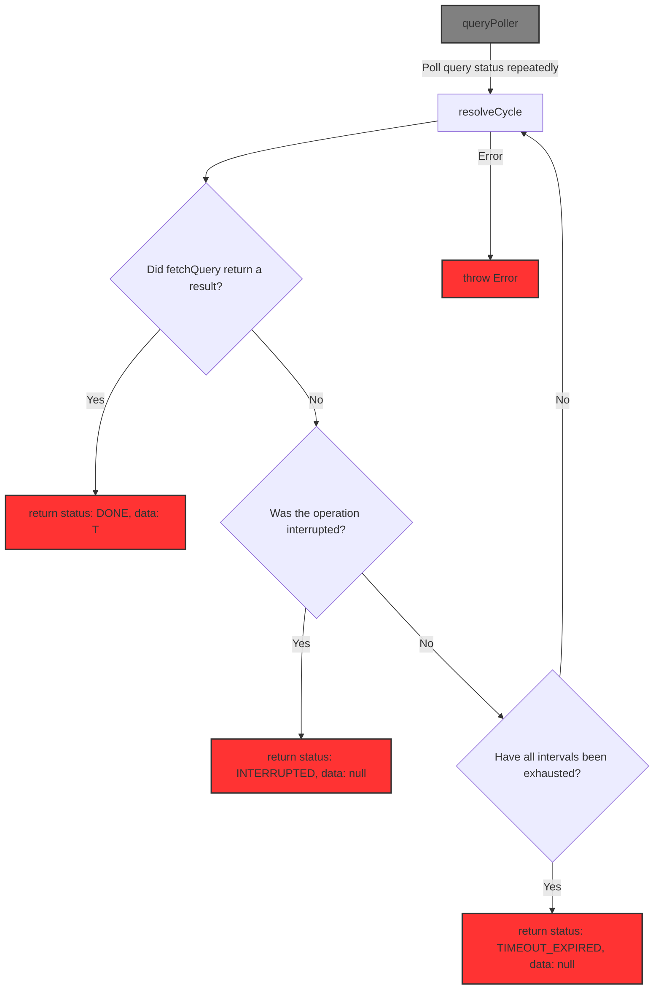

# taktwerk-poller

[](https://www.npmjs.com/package/taktwerk-poller)


A lightweight and deterministic asynchronous polling module that supports multi-stage polling with different intervals and durations, optional interruption, and predictable typed result statuses.

## Key Advantages

- Multi-stage polling with independent intervals and durations
- Deterministic outcomes (`DONE`, `TIMEOUT_EXPIRED`, `INTERRUPTED`)
- Optional interruption via promise or `AbortController`
- Fully typed result states for safe handling
- Lightweight and dependency-free

## 📦 Installation

```bash
npm install taktwerk-poller
```

or using yarn:

```
yarn add taktwerk-poller
```

## Quick Example

```typescript
import { queryPoller } from 'taktwerk-poller'

// Two-stage polling strategy
const rangeIntervals = [
  { durationMs: 1_000, intervalMs: 300 },
  { durationMs: 4_000, intervalMs: 1_000 },
]

// Simulated async query:
// - returns undefined on the first two calls
// - returns "DONE" on the third call
let callCount = 0

async function fetchQuery(): Promise<string | undefined> {
  callCount += 1

  if (callCount === 3) {
    return 'DONE'
  }

  return undefined
}

// Interruption controller using Promise.withResolvers
let interruptController = Promise.withResolvers<void>()

async function startMonitoring() {
  console.log('Monitoring started...')

  // reset before each run
  interruptController = Promise.withResolvers<void>()

  try {
    const result = await queryPoller(
      fetchQuery,
      rangeIntervals,
      interruptController.promise,
    )

    switch (result.status) {
      case 'DONE':
        console.log('Status: DONE')
        console.log('Data:', result.data)
        break

      case 'TIMEOUT_EXPIRED':
        console.log('Status: TIMEOUT_EXPIRED')
        break

      case 'INTERRUPTED':
        console.log('Status: INTERRUPTED')
        break
    }
  } catch (error) {
    console.error('Unexpected error while monitoring:', error)
  }
}

// Can be triggered from UI / CLI / whatever
function stopMonitoring() {
  interruptController.resolve()
}

// Example usage:
startMonitoring()

// For demo purposes, interrupt after 2 seconds:
setTimeout(() => {
  console.log('Interrupting…')
  stopMonitoring()
}, 2000)
```

## How it works

Polling stops as soon as one of the conditions is met:

- fetchQuery returns a non-undefined result
- the operation is interrupted
- all configured intervals are exhausted

Interruption can be implemented either via an external promise (as in the example above),
or internally using AbortController inside fetchQuery.

Each interval stage defines:

- how often the query is retried (intervalMs)
- how long that stage may run (durationMs)


